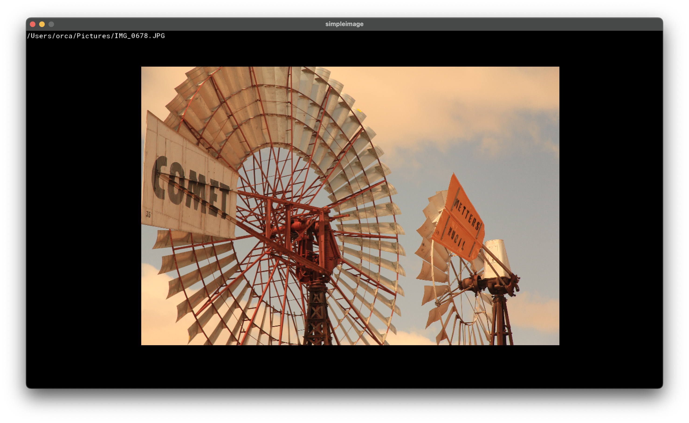

# gml-simpleimage

A simple image viewer for GameMaker!

This isn't particularly anything special, but I'm working on a simple editor at
the moment and its code was really easy to adapt into something that can be used
for viewing instead, so here we go!

## Keybinds
|     Key     |     Action    |
|-------------|---------------|
|  L          | Load an image |
|  F          | Fullscreen    |
| LMB         | Pan           |
| Mouse wheel | Zoom          |
| Arrows      | Pan (keyboard)|
| Shift+Arrows| Prev/Next img|

\*Mouse wheel speed is set to work well on a trackpad. I'll add some settings later,
maybe.

## Formats
Current file format support:
 - [x] `png`
 - [x] `jpg`/`jpeg`
 - [x] `gif` \*currently via `sprite_add()`, so no animation support yet.
 - [x] `bmp` \*currently supports only 24-bit colour BMPs
